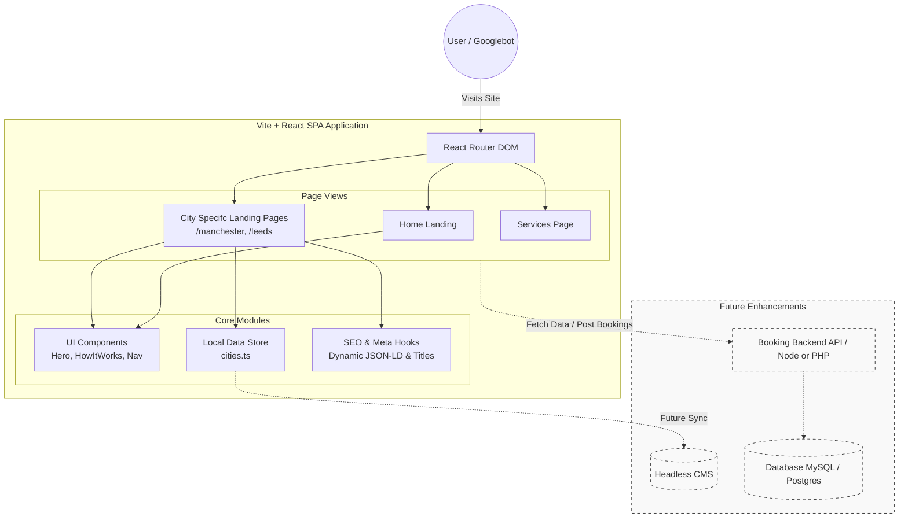

# The Laundry Man - Web Application

This repository contains the frontend web application for "The Laundry Man," an eco-friendly premium laundry and dry cleaning service. 

## 1. Tech Stack

This application is built with a modern frontend stack focusing on speed, performance, and responsive design:

*   **Frontend Library:** **React.js** (v18) utilizing functional components and hooks.
*   **Module Bundler & Dev Server:** **Vite**, chosen for its extremely fast Hot Module Replacement (HMR) and optimized builds.
*   **Language:** **TypeScript**, ensuring type safety, better developer experience, and fewer runtime errors.
*   **Styling:** **Tailwind CSS**, a utility-first CSS framework for rapid UI development and seamless responsive design.
*   **Routing:** **React Router DOM**, handling client-side routing and virtual page navigation (e.g., `/manchester`).
*   **Animations:** **Framer Motion**, used for scroll-triggered enter animations, layout transitions, and interactive hover effects.
*   **Icons:** **Lucide React**, providing a clean, consistent set of SVG icons.

---

## 2. How to Install on a Traditional PHP + SQL Host 

Since this application is a "Single Page App" (SPA), it does not run on PHP. Instead, the framework compiles it into highly optimized **static files** (HTML, CSS, and JS) that can be easily hosted on *any* web server, including traditional Apache/cPanel shared hosting platforms.

Here are the exact steps to deploy:

### Step 1: Build the Application
Before uploading to your host, you must compile the code. On your local machine (where Node.js is installed), run:
```bash
npm install
npm run build
```
This will create a `dist/` directory containing your production-ready static assets.

### Step 2: Upload to your Hosting Provider
1. Log into your hosting provider's File Manager (or use FTP/SFTP).
2. Navigate to your domain's root folder (usually `public_html` or `www`).
3. Upload **all the contents inside** the newly generated `dist/` folder (do not upload the `dist` folder itself, just what is inside it) directly into `public_html`.

### Step 3: Configure `.htaccess` for React Router (Crucial Step)
Because React Router handles its own routing, your web server doesn't know what to do if a user directly visits a subpage like `yourdomain.com/manchester`. By default, an Apache server will look for a physical folder named `manchester` and throw a **404 Not Found** error.

To fix this, you must tell the server to route all traffic back to `index.html`. 
Create a file named `.htaccess` in your `public_html` folder and add the following configuration:

```apache
<IfModule mod_rewrite.c>
  RewriteEngine On
  RewriteBase /
  RewriteRule ^index\.html$ - [L]
  RewriteCond %{REQUEST_FILENAME} !-f
  RewriteCond %{REQUEST_FILENAME} !-d
  RewriteCond %{REQUEST_URI} !^/api/ [NC]
  RewriteRule . /index.html [L]
</IfModule>
```
*Note on Database/Backend: The current architecture is purely a frontend application. You do not need to configure an SQL database unless you decide to build out a custom PHP backend API in the future (e.g., placed in a `/api/` folder) to handle booking submissions instead of relying on email/third-party processing.*

---

## 3. SEO Tactics and the "City Landing Pages" Strategy

While this application acts as a Single Page App (where pages don't technically hard-reload between clicks), we have implemented strategies to ensure search engines can index individual locations.

### Dynamic Metadata Update
We added a React `useEffect` hook that listens to the `city` parameter in the URL. When a user or search engine navigates to `/manchester`, the code dynamically updates the document's `<title>` and `<meta name="description">` tags to specifically inject "Manchester". 

While traditional SEO relies on Server-Side Rendering (SSR), modern Googlebot executes Javascript and will successfully read these dynamically updated meta tags.

### Why Distinct Landing Pages Give You an Edge
1. **Targeted Long-Tail Keywords:** Ranking a single homepage for "Laundry Service UK" is highly competitive. Ranking a specific page for **"Premium Laundry Service in Leeds"** is much easier. Dedicated landing pages allow you to target localization queries.
2. **Relevancy Metrics:** When a user searches for a service in their city, Google prioritizes pages with a strong local signal. Having `/leeds` in the URL alongside distinct visual cues (the "Leeds" text dynamically highlighted in script font) lowers bounce rates because users immediately confirm you service their specific area.
3. **Link Building & Marketing Strategy:** Having dedicated URLs means you can run localized Facebook/Google Ads directly to `yourdomain.com/birmingham` rather than dropping the user on a generic homepage.

---

## 4. Architecture & Future Extensibility

The application is built with a highly modular component-based architecture designed for low-friction scaling and future feature enhancements. 

### Extensibility Analysis

*   **Component Modularity:** Because the UI is built utilizing React components (e.g., `<Hero />`, `<ServicesOverview />`), new features or pages can be assembled rapidly by re-using existing, styled building blocks without risking regressions in other parts of the app.
*   **Decoupled Data Layer:** The recent introduction of `src/data/cities.ts` proves the app's capability to separate "content" from "presentation". This allows non-developers or a future Headless CMS (like Sanity or Strapi) to inject data without touching the React code.
*   **Predictable Scaling via TypeScript:** The strict typing ensures that as the application grows (e.g., adding a customer portal or complex booking forms), the compiler will catch structural errors before they hit production, vastly reducing manual QA time.
*   **Backend Readiness:** The SPA architecture is natively decoupled. At any point, the client can choose to integrate a real API backend (Node.js/Express, Laravel/PHP, or Firebase) to handle user authentication, booking history, and driver routing without needing to rewrite the frontend. 

### Architecture Diagram


